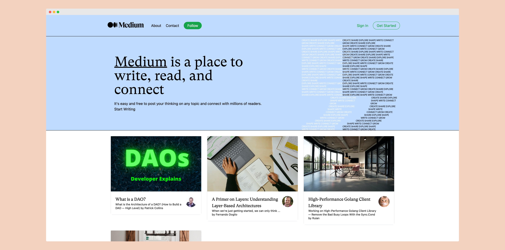
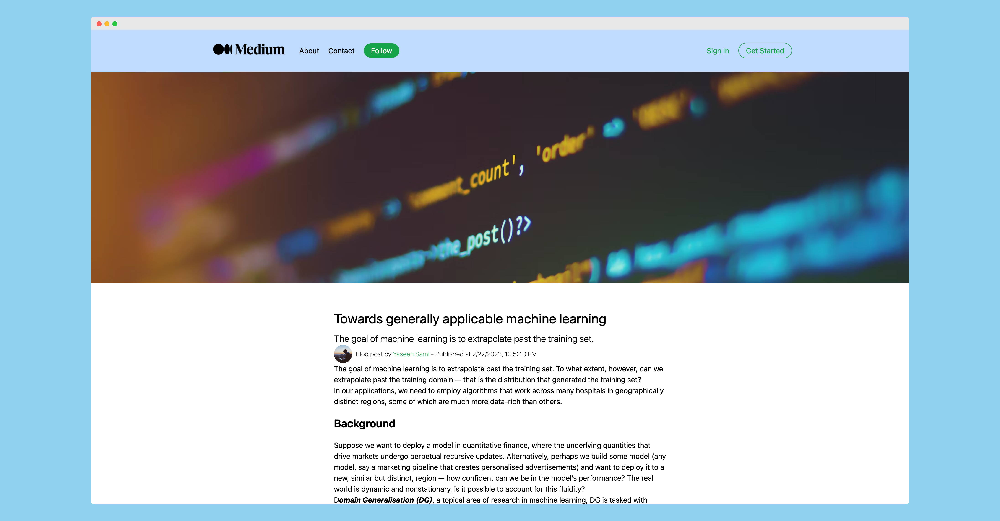
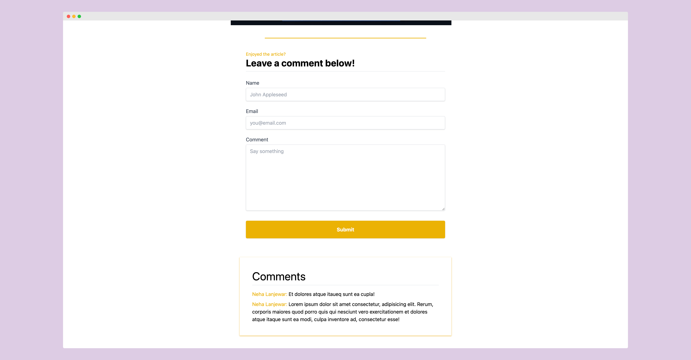

## About

Medium Clone

---

## Tech used:

- Next.js
- Sanity CMS
- Tailwind CSS
- Typescript

## Best practices

- Keep components as many components as dumb as possible for better testing and predictability. Make only a selected few into Smart Components.
- Keep files small.
- Use descriptive and consistent names for variables, files, etc.
- Abstract out code into smaller reusuable functions or components as much as possible
- Avoid code duplication
- Follow naming conventions
- Use absolute imports by configuring path aliases to avoid `../../../../../` nightmare
- Favicon support keeping the operating system in mind that display it differently.
- Sensible folder structure
- Commit often
- Write good commit messages
- Environment variables used to configure environments and to protect secrets

## How to run the code in development mode

- Clone the project repo
- Create a `.env.local` file into the project home folder and make sure it has all the necessary environment variables. Refer to `.env.example` file for an example.
- Change into the project directory and run `npm install`
- Make sure Sanity CLI is installed.
- Change into the cms directory instead the project and run `npm install`
- To run the server run `npm run dev` from project home directory and `npm start` from `cms` directory

## App Preview

Landing page

Article

Comments

